# Performance Assessment Agent (`com_agent`) — Workflow Architecture

This document specifies the complete workflow, execution lifecycle, triggers, LangGraph node transitions, human-in-the-loop interrupts, and persistence schema for the Individual Student Performance Assessment Agent.

---

## 1. End-to-End Workflow Diagram

```mermaid
flowchart TD
    %% Triggers
    subgraph Triggers ["System Triggers"]
        T1["Trigger 1: Sprint End (Automated Webhook)"]
        T3["Trigger 3: On-Demand (Lecturer Dashboard)"]
        T2["Trigger 2: Student Quiz Submission"]
        T4["Trigger 4: Lecturer Review & Override"]
        TW["Timeout Watcher (Periodic 48h/96h Cron/Job)"]
    end

    %% Ingestion & Pooling
    subgraph Ingestion ["1. Sandbox Ingestion & Evidence Pool"]
        Clone["Clone/Fetch Team Repo<br/>(Single Sandbox /repos/team_{team_id})"]
        Bloat["Dependency Bloat & Safe Truncation<br/>(total_raw_loc, dep_loc, net_human_loc)"]
        Pool[("PostgreSQL student_evidence_pool<br/>Native JSONB Raw & Factor Data")]
    end

    %% LangGraph Passive Stage
    subgraph PassiveStage ["2. LangGraph Validation & Parallel Passive Factors"]
        Val["Node 1: validate_context_node<br/>(Git emails, author tokens, repo checks)"]
        
        subgraph FanOut ["Parallel Fan-Out (asyncio.gather)"]
            F1["Node 2: Effort Tool<br/>(Net LOC, Commits, Churn, File Spanning)"]
            F2["Node 3: Consistency Tool<br/>(Active Days, Daily Spread, Gini)"]
            F3["Node 4: Req Fulfillment Tool<br/>(Scrum Done/Planned, Reopened Tasks)"]
            F4["Node 5: Collaboration Tool<br/>(PR Reviews, Discussions, Issue Comments)"]
            F5["Node 6: Task Complexity Tool<br/>(Story Points, Tech Stack Breadth)"]
        end

        FanIn["Node 7: join_passive_factors_node<br/>(Dict merge into factor_scores)"]
    end

    %% Active Verification Stage
    subgraph ActiveStage ["3. Active Verification & Code Ownership Quiz"]
        AST["Node 8: ast_quiz_generator_node<br/>(AST Token Parser, Cyclomatic Complexity,<br/>SyntaxError Resilient)"]
        PauseQuiz{"Interrupt 1: await_quiz_response_node<br/>Paused in Checkpointer"}
        EvalOwn["Node 9: evaluate_ownership_tool<br/>(Scores Knowledge Ownership 0.0 - 1.0,<br/>Applies 0.50 cap if expired)"]
    end

    %% Synthesis & Review Stage
    subgraph SynthesisStage ["4. Synthesis, Fusion & Discrepancies"]
        Persona["Node 10: run_behavioral_pattern_node<br/>(Classifies Persona: Proactive, Solitary, Ghost, etc.)"]
        Fusion["Node 11: deterministic_fusion_node<br/>(AHP 6-Factor Weighted Fusion)"]
        Disc["Node 12: discrepancy_detection_node<br/>(Cross-validates Effort vs Ownership, etc.)"]
        PauseRev{"Interrupt 2: Requires Human Review?<br/>(Critical Discrepancy Alert)"}
        Rev["Node 13: lecturer_review_node<br/>(Lecturer Override / Approval)"]
    end

    %% Privacy, Explanation & Export Stage
    subgraph ExportStage ["5. Privacy, LLM Explanation & Persistence"]
        MemLoad["Node 14: load_cross_sprint_memory_node<br/>(Fetch Previous Sprints Baseline)"]
        PIIRedact["Node 15: pii_redaction_sanitizer_node<br/>(Mask Names, IDs, Emails -> Tokens)"]
        LLMExp["Node 16: generate_explanation_node<br/>(LLM: Formative Feedback & Instructor Dossier)"]
        PIIRestore["Node 17: pii_restore_node<br/>(Restore Real Identifiers)"]
        MemSave["Node 18: update_cross_sprint_memory_node<br/>(Update Student Long-Term Trajectory)"]
        ExportDB[("Node 19: export_results_node<br/>Save to assessment_results,<br/>student_feedback, & JSON")]
    end

    %% Flow Connections
    T1 --> Clone
    T3 --> Clone
    Clone --> Bloat --> Pool --> Val
    Val --> FanOut
    FanOut --> FanIn --> AST --> PauseQuiz

    %% Quiz Resumption
    T2 --> PauseQuiz
    TW -. "timeout: True" .-> PauseQuiz
    PauseQuiz --> EvalOwn --> Persona --> Fusion --> Disc
    Disc --> PauseRev
    
    %% Review Resumption
    PauseRev -- "Critical Alert (True)" --> T4 --> Rev --> MemLoad
    PauseRev -- "No Critical Alert (False)" --> MemLoad

    %% Final pipeline
    MemLoad --> PIIRedact --> LLMExp --> PIIRestore --> MemSave --> ExportDB
```

---

## 2. Phase-by-Phase Walkthrough

### Phase 1: Ingestion & Team Sandbox Setup
- **Single Team Clone**: Clones once per team into `sandbox/team_{team_id}` via `clone_or_fetch_team_repo`. Team members share the repository with author-level isolation (`--author`).
- **Dependency Bloat Calculation**: `detect_dependencies_and_clean_loc()` distinguishes student code from vendor/lock files (`node_modules`, `vendor/`, `package-lock.json`, minified bundles).
  - Calculates `total_raw_loc`, `dependency_loc`, `net_human_loc`, and sets `has_committed_dependencies = True`.
  - Truncates large diff text to prevent token and database bloat while keeping exact metric values for accurate effort penalties.
- **Non-Lossy Evidence Pool**: Persists uncompressed raw data and factor payloads into PostgreSQL `student_evidence_pool` as native JSONB.
- **On-Demand Caching**: When triggered on-demand with `force_refresh=False`, existing pooled snapshots are reused instantly.

### Phase 2: Context Validation & Parallel Factor Ingestion
- **Node 1: `validate_context_node`**: Validates required context (`student_id`, sprint dates, git emails).
- **Nodes 2–6: Parallel Fan-Out (`asyncio.gather`)**:
  - **Factor 1 (`run_effort_tool`)**: Net Human LOC, commit count, churn ratio, file diversity.
  - **Factor 2 (`run_consistency_tool`)**: Active sprint days, daily commit distribution, Gini uniformity.
  - **Factor 3 (`run_req_fulfillment_tool`)**: Scrum story points done vs planned, task reopen rate.
  - **Factor 4 (`run_collaboration_tool`)**: PR reviews authored, issue discussions, teammate comments.
  - **Factor 5 (`run_complexity_tool`)**: Story point difficulty, tech stack variety.
- **Node 7: `join_passive_factors_node`**: Fan-in dictionary merge into `state["factor_scores"]`.

### Phase 3: Active Verification & Code Ownership Quiz (Interrupt 1)
- **Node 8: `ast_quiz_generator_node`**:
  - Uses Python AST to extract authored functions and tokens.
  - Resilient to `SyntaxError` on incomplete code committed right at deadlines.
  - Calculates McCabe cyclomatic complexity ($V(G) = 1 + \text{decision points}$).
  - Generates a targeted comprehension question and sets `quiz_deadline = now + 48h`.
- **Interrupt 1 (`await_quiz_response_node`)**: Pauses execution in the checkpointer (`PostgresSaver` in prod, `MemorySaver` in dev).
- **Wakeup / Resumption**:
  - Student submits answer via **Trigger 2** (`submit_quiz_response`).
  - Automated watcher (`check_expired_quiz_timeouts`) wakes up expired threads with `Command(resume={"timeout": True})`.
- **Node 9: `evaluate_ownership_tool`**: Evaluates student explanation against the AST snippet (Factor 6), capping score at 0.50 if submitted during the 48-hour extension window.

### Phase 4: Synthesis, Deterministic Fusion & Discrepancies
- **Node 10: `run_behavioral_pattern_node`**: Identifies student persona:
  - *Proactive Collaborator*, *Inconsistent Contributor*, *Ghost Committer*, *Solitary Specialist*, or *Balanced Team Member*.
- **Node 11: `deterministic_fusion_node`**: Computes final grade using AHP factor weights (`weights_config.yaml`):
  $$\text{Final Score} = \sum_{i=1}^{6} w_i \cdot \text{Score}_i$$
- **Node 12: `discrepancy_detection_node`**: Flags integrity anomalies:
  - *High LOC + Low Ownership* (AI dump / plagiarism suspicion).
  - *High Task Done + Zero Commits* (Free-rider suspicion).
  - If critical discrepancies are detected, sets `requires_human_review = True`.

### Phase 5: Lecturer Review (Interrupt 2)
- **Interrupt 2**: If `requires_human_review == True`, thread pauses at `pending_lecturer_review`.
- **Resumed via Trigger 4 (`submit_lecturer_review`)**: Lecturer reviews discrepancy alerts and either approves or provides an overridden score (`0.0 - 1.0`).
- **Node 13: `lecturer_review_node`**: Records lecturer override and audit trail.

### Phase 6: Privacy, LLM Explanation & Export
- **Node 14: `load_cross_sprint_memory_node`**: Loads prior sprint baselines to evaluate learning trajectory.
- **Node 15: `pii_redaction_sanitizer_node`**: Anonymizes PII (names, IDs, emails) before LLM prompt execution.
- **Node 16: `generate_explanation_node`**: Generates Formative Feedback (student-facing) and Instructor Dossier (grading audit).
- **Node 17: `pii_restore_node`**: Restores actual student identifiers in the generated documents.
- **Node 18: `update_cross_sprint_memory_node`**: Persists sprint history for multi-sprint longitudinal tracking.
- **Node 19: `export_results_node`**: Commits records to PostgreSQL tables:
  - `assessment_results`
  - `student_feedback`

---

## 3. Database Schema Reference

| Table Name | Purpose | Key Attributes |
|---|---|---|
| **`student_evidence_pool`** | Non-lossy raw evidence snapshot & factor payloads | `student_id`, `sprint_id`, `team_id`, `repo_url`, `raw_evidence` (JSONB), `factor_payloads` (JSONB), `ingested_at` |
| **`assessment_results`** | Official assessment grade & instructor dossier | `student_id`, `sprint_id`, `team_id`, `final_score`, `behavioral_persona`, `lecturer_override_applied`, `data` (JSONB) |
| **`student_feedback`** | Sanitized formative feedback for student view | `student_id`, `sprint_id`, `final_score`, `behavioral_persona`, `data` (JSONB), `created_at` |
| **`cohort_baselines`** | Cohort distributions & baseline metrics | `team_id`, `sprint_id`, `baseline_metrics` (JSONB), `computed_at` |
