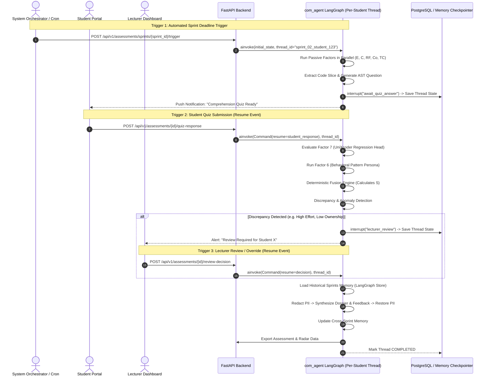
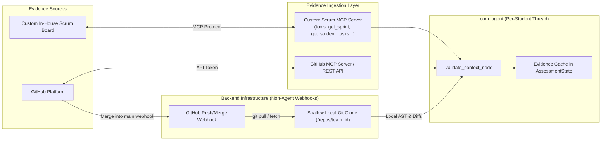

# Production-Grade LangGraph Architecture & Implementation Plan: `com_agent`
**Component:** Individual Student Performance Assessment (`performance_assessment`)  
**Project ID:** `J26-SE-363` (CEAI)  
**File Location:** `backend/app/agents/performance_assessment/com_agent/PLAN.md`

As established in `PROPOSAL.md`, **the `com_agent` coordinates, routes, validates, and explains all 7 evaluation factors, but strictly DOES NOT do markings or invent scores**. All scores are computed either by specialized factor computational tools or by the deterministic fusion engine. Factor-internal mechanics (such as AST parsing, regression weights, and code retrieval) remain strictly encapsulated inside their respective `factor_models/` directories.

---

## 1. LangGraph StateGraph Workflow

The agent is implemented as a **LangGraph `StateGraph`** with state persistence (Checkpointer), asynchronous parallel execution (fan-out / fan-in), and human-in-the-loop (HITL) interrupt handling.

```mermaid
flowchart TD
    START([__start__]) --> ValidateContext[validate_context_node]
    
    subgraph ParallelPassive["Parallel Passive Execution (Async Fan-Out)"]
        ValidateContext --> RunEffort[run_effort_tool]
        ValidateContext --> RunConsistency[run_consistency_tool]
        ValidateContext --> RunReqFulfillment[run_req_fulfillment_tool]
        ValidateContext --> RunCollaboration[run_collaboration_tool]
        ValidateContext --> RunComplexity[run_complexity_tool]
    end

    RunEffort & RunConsistency & RunReqFulfillment & RunCollaboration & RunComplexity --> JoinPassive[join_passive_factors_node]
    
    JoinPassive --> ASTQuizGen[ast_quiz_generator_node]
    ASTQuizGen --> AwaitStudentResponse[await_quiz_response_node\n(LangGraph interrupt / checkpoint)]
    AwaitStudentResponse --> EvaluateOwnership[evaluate_ownership_tool]
    
    EvaluateOwnership --> BehavioralPattern[run_behavioral_pattern_node]
    BehavioralPattern --> DeterministicFusion[deterministic_fusion_node\n(Mathematical S Calculation - No LLM)]
    
    DeterministicFusion --> AnomalyCheck[discrepancy_detection_node]
    
    AnomalyCheck -->|Discrepancy Detected\ne.g. High Effort + Low Ownership| HumanReview[lecturer_review_node\n(LangGraph interrupt / override)]
    AnomalyCheck -->|Normal Profile| LoadMemory[load_cross_sprint_memory_node]
    HumanReview --> LoadMemory
    
    LoadMemory --> PIIRedact[pii_redaction_sanitizer_node]
    PIIRedact --> GenerateExplanation[generate_explanation_node\n(LLM synthesis of report & feedback)]
    GenerateExplanation --> PIIRestore[pii_restore_node]
    
    PIIRestore --> UpdateMemory[update_cross_sprint_memory_node]
    UpdateMemory --> PersistAndExport[export_results_node]
    PersistAndExport --> END([__end__])
```

---

## 2. Graph Triggers & Execution Lifecycle

The `com_agent` LangGraph does not run in a continuous busy-loop. Its lifecycle is driven by four discrete system triggers:



### 2.1 The Four Execution Triggers
1. **Trigger 1: Automated Sprint End Trigger (The Primary Entrypoint)**
   - **Source:** Background scheduler (Cron) or GitHub Webhook (`milestone:closed` / `sprint:completed`) via the System Orchestrator.
   - **Action:** Pre-computes cohort z-score baseline $\mu, \sigma$. Spawns independent per-student LangGraph threads (`thread_id = f"sprint_{sprint_id}_student_{student_id}"`). Executes Stage 1 (passive factors 1–5), selects the student's highest-signal code chunk, generates the AST comprehension question, and pauses at `await_quiz_response_node` using `interrupt()`.
2. **Trigger 2: Student Quiz Submission Trigger (Resumption Event)**
   - **Source:** Student Portal API webhook when the student submits their natural language explanation to the AST question.
   - **Action:** Resumes the thread via `graph.ainvoke(Command(resume={"student_response": text}), config)`. Evaluates Code Ownership, classifies Behavioral Pattern, executes deterministic score fusion, and evaluates discrepancy rules.
3. **Trigger 3: On-Demand Lecturer Trigger (Manual Dashboard Trigger)**
   - **Source:** Lecturer clicks **"Generate Assessment"** or **"Re-evaluate"** on the Lecturer Dashboard.
   - **Action:** Starts or re-runs the entire pipeline on demand for a single student or the team.
4. **Trigger 4: Lecturer Review / Override Resumption Trigger**
   - **Source:** Lecturer reviews a flagged discrepancy on the Lecturer Dashboard and approves the score or provides an overridden grade.
   - **Action:** Resumes the paused thread via `graph.ainvoke(Command(resume={"override_score": val, "reason": text}), config)` to finalize report generation.

---

## 3. Per-Student Isolation Model & Cohort Baselines

When the trigger fires, the agent **focuses on one student at a time per LangGraph execution thread**:

```
[Sprint End Trigger]
         │
         ▼
[Step 1: Ingestion & Cohort Baseline Pre-Pass]
(Compute Cohort Means μ and Std σ for CC, LOC, FC)
         │
         ├─────────────────────────────────────────────┐
         ▼                                             ▼
[Thread 1: Student A]                         [Thread 2: Student B]
(Runs Factors 1-5)                            (Runs Factors 1-5)
(Generates Quiz A)                            (Generates Quiz B)
(Pauses for Student A)                        (Pauses for Student B)
         │                                             │
(Student A answers in 30 mins)                (Student B answers in 18 hours)
         │                                             │
(Resumes Thread 1 -> Final Score A)           (Resumes Thread 2 -> Final Score B)
```

### Why One Student Per Thread:
* **Independent Quiz Timelines:** Each student receives an active comprehension question based on their own code. Student A may respond in 30 minutes, whereas Student B takes 24 hours. Thread isolation ensures Student A receives their feedback immediately without being blocked.
* **Failure Isolation:** Any unusual edge case (e.g. no tasks assigned, zero commits) is isolated to that student's thread and handled by fallback policies without halting team evaluation.

---

## 4. Evidence Gathering Layer: Scrum MCP & GitHub Hybrid Strategy



### 4.1 Custom Scrum Board MCP Server
Because the Scrum board is an in-house service, it exposes a dedicated Model Context Protocol (MCP) server providing:
* `get_sprint_details(sprint_id)`: Sprint start date, end date, milestones.
* `get_student_tasks(sprint_id, student_id)`: Assigned tasks, status transitions, story points ($SP$), subtasks count ($SC$).
* `get_task_acceptance_criteria(task_id)`: Task description ($TD_j$) and acceptance criteria ($AC_j$) for Factor 3.
* `get_task_status_history(task_id)`: Column movement timestamps (evaluates steady progress vs. deadline rushing).

### 4.2 GitHub Hybrid Strategy (MCP + Local Clone via Webhook)
* **Backend Infrastructure (No agent needed):** When students push or merge code to the repository, a GitHub webhook notifies the backend to update a shallow local Git clone (`git fetch / git pull`).
* **Agent's Responsibility:** When gathering evidence for a student:
  * Uses **GitHub MCP / API** for author-level filtering, PR review comments, issue conversations, mentions, and reaction response rates.
  * Uses the **Local Clone** for lightning-fast diff inspection, AST parsing (Tree-sitter), and pre-sprint dependency graph traversal without exhausting GitHub API rate limits.

---

## 5. Seven Factor Responsibilities & Clean Student Isolation

In a shared repository where multiple students commit to the same branches, evidence is cleanly isolated:

| Factor | Features Needed | Source | Clean Isolation in Shared Repo |
|---|---|---|---|
| **01 Effort ($E$)** | $CC$ (Commits), $LOC_{net}$ (Net lines), $FC$ (Files), $CT$ (Tasks), $RD$ (Reviews) | GitHub + Scrum | • Filter commits by `author` / commit email.<br>• Exclude merge commits (`parents > 1`).<br>• Count reviews authored by student on teammates' PRs. |
| **02 Consistency ($C$)** | $AWR$ (Active windows), $DC$ (Deadline rush), $LI_{norm}$ (Inactivity), $CV_{norm}$ (Variability) | GitHub | • Uses sorted commit timestamps of this student only across sprint duration. |
| **03 Req. Fulfillment ($RF$)** | Task descriptions ($TD_j$), Acceptance criteria ($AC_j$), Task diffs ($CD_j$) | Scrum + GitHub | • Map student's individual commit diffs to their assigned Scrum tasks.<br>• LLM assesses task alignment. |
| **04 Collaboration ($Co$)** | $PRC_{depth}$, $IC_{depth}$, $MC$ (Mentions), $PCount$, $CCount$, $IR$ (Response rate) | GitHub | • Filter comments where `author == student` on PRs created by *other* team members.<br>• Measure student's response speed to comments on their own PRs. |
| **05 Task Complexity ($TC$)** | $SP$ (Points), $SC$ (Subtasks), $FI$ (Files), $DR$ (Dependency reach), $CB$ (Component breadth) | Scrum + GitHub (Clone) | • Structural metrics computed on pre-sprint codebase DAG for the files assigned in student's tasks. |
| **06 Behavioral Pattern ($BP$)** | Output scores of $E, C, Co, KO$, untracked commit ratio | Internal | • Literature-backed rule classifier (outputs persona & modifier $0.80 - 1.20$). |
| **07 Code Ownership ($KO$)** | High-signal code slice authored by student, AST question, student answer | GitHub + AST | • Identify code segment from student's commits.<br>• AST quiz generation & UniXcoder evaluation. |

### Edge Case Resolutions:
1. **Student Identity Mapping:** Map both the student's **GitHub Username** (`user.login`) and **Git Commit Email(s)** (`commit.author.email`) in the student profile so unlinked local git configurations are never lost.
2. **Merge Commit Filtering:** Exclude merge commits (`len(commit.parents) > 1`) from $CC$ and $LOC_{net}$ to prevent crediting a student with teammates' code during branch merges.
3. **Dependency Graph Traversal:** Run pre-sprint DAG dependency reach ($DR$) and component breadth ($CB$) directly on the local clone, falling back to `get_tree` over MCP.

---

## 6. Prompt Management via YAML Schema

All prompt templates are externalized into structured YAML configuration files (`prompts.yaml`), managed and validated by a strongly-typed Pydantic schema (`PromptConfig`). No hardcoded prompt strings exist in Python code.

### 6.1 Pydantic Prompt Schema (`prompt_loader.py`)

```python
from pydantic import BaseModel, Field
from typing import List, Dict, Any, Optional

class PromptDefinition(BaseModel):
    prompt_id: str
    version: str
    role: str = Field(..., description="System persona and expertise definition")
    objective: str = Field(..., description="Clear definition of what to synthesize")
    strict_constraints: List[str] = Field(..., description="Inviolable guardrails (e.g. no mark tampering)")
    input_variables: List[str] = Field(..., description="Expected dynamic placeholders")
    output_schema_format: str = Field(..., description="Expected structure (markdown, json)")
    model_parameters: Dict[str, Any] = Field(default_factory=lambda: {"temperature": 0.2, "top_p": 0.95})
    system_prompt_template: str
    user_prompt_template: str

class PromptLibrary(BaseModel):
    version: str
    prompts: Dict[str, PromptDefinition]
```

### 6.2 YAML Prompt Schema Definition (`com_agent/prompts/prompts.yaml`)

```yaml
version: "1.0.0"
prompts:
  instructor_assessment_dossier:
    prompt_id: "instructor_assessment_dossier"
    version: "1.0.0"
    role: "Senior Software Engineering Academic Evaluator and Data-Driven Assessment Specialist"
    objective: "Synthesize factor scores, evidence traces, and discrepancy alerts into a formal, transparent instructor dossier."
    strict_constraints:
      - "STRICTLY FORBIDDEN: You must never compute, adjust, or override any numerical factor scores or the final score S."
      - "STRICTLY FORBIDDEN: Do not invent missing data. Only reference the exact commit SHAs, PR IDs, and task IDs provided."
      - "EXPLAINABILITY: Connect each score explicitly to the student's concrete actions (e.g. steady commits vs. late rush)."
      - "ANOMALIES: If discrepancy flags are present, highlight them clearly under a dedicated 'Attention Required' section."
    input_variables:
      - "student_name"
      - "student_id"
      - "sprint_id"
      - "factor_scores"
      - "final_score"
      - "behavioral_persona"
      - "behavioral_modifier"
      - "discrepancy_flags"
      - "evidence_summary"
      - "historical_trajectory"
    output_schema_format: "github_markdown"
    model_parameters:
      temperature: 0.15
      max_tokens: 1500
    system_prompt_template: |
      You are a {role}.
      Objective: {objective}
      
      MANDATORY CONSTRAINTS:
      {strict_constraints}
    user_prompt_template: |
      Student: {student_name} ({student_id})
      Sprint: {sprint_id}
      Persona Assigned: {behavioral_persona} (Modifier: {behavioral_modifier})
      
      Final Mathematical Score: {final_score} / 1.00
      Factor Breakdown:
      {factor_scores}
      
      Discrepancy Alerts:
      {discrepancy_flags}
      
      Evidence Traces:
      {evidence_summary}
      
      Historical Trajectory (Previous Sprints):
      {historical_trajectory}
      
      Generate the formal Instructor Dossier in GitHub-flavored markdown.

  student_formative_feedback:
    prompt_id: "student_formative_feedback"
    version: "1.0.0"
    role: "Supportive and Constructive Pedagogical Software Engineering Mentor"
    objective: "Provide encouraging, actionable, and formative feedback to help the student improve their agile engineering habits."
    strict_constraints:
      - "NEVER alter or contradict the official mathematical score."
      - "Highlight at least 2 concrete strengths based on real evidence."
      - "Provide 2 specific, constructive engineering actions for the upcoming sprint (e.g. earlier commits, more PR reviews)."
      - "Tone must be encouraging, professional, and pedagogical."
    input_variables:
      - "student_name"
      - "sprint_id"
      - "final_score"
      - "factor_scores"
      - "behavioral_persona"
      - "historical_trajectory"
    output_schema_format: "github_markdown"
    model_parameters:
      temperature: 0.3
      max_tokens: 1000
    system_prompt_template: |
      You are a {role}.
      Objective: {objective}
      
      RULES:
      {strict_constraints}
    user_prompt_template: |
      Student Name: {student_name}
      Sprint: {sprint_id}
      Final Contribution Score: {final_score} / 1.00
      Factor Scores: {factor_scores}
      Contributor Archetype: {behavioral_persona}
      Historical Trajectory: {historical_trajectory}
      
      Generate pedagogical formative student feedback.
```

---

## 7. Enterprise Layer: PII Redaction, Observability & Two-Tier Memory

To meet production-grade enterprise standards, the `com_agent` integrates security, monitoring, and stateful memory without touching factor grading internals.

```mermaid
flowchart LR
    subgraph Security["Privacy Layer (Pre/Post LLM)"]
        RawData[Raw Context & Scores] --> PIIRedactNode[pii_redaction_sanitizer_node]
        PIIRedactNode --> AnonymizedPrompt[Anonymized Prompt: '[STUDENT_A]']
        AnonymizedPrompt --> LLMCall[generate_explanation_node]
        LLMCall --> PIIRestoreNode[pii_restore_node]
        PIIRestoreNode --> FinalReport[Personalized Report]
    end

    subgraph Observability["Observability (LangSmith / OpenTelemetry)"]
        Trace[LangChain Tracing] --> Metrics[Token Usage, Node Latency, Tool Execution Times]
    end

    subgraph Memory["Two-Tier Memory Management"]
        Checkpointer["Short-Term: PostgresSaver (Thread State & Interrupt Pauses)"]
        Store["Long-Term: LangGraph PostgresStore (Cross-Sprint Student Profile)"]
    end
```

### 7.1 PII Redaction & Sanitization
* **Purpose:** Ensures student personal identifying information (real names, student IDs, private emails) is never leaked to external third-party LLMs (e.g. OpenAI/Gemini/Anthropic).
* **Mechanism:**
  * `pii_redaction_sanitizer_node`: Replaces `student_name` with `[STUDENT_A]`, `student_id` with `[STUDENT_ID]`, and emails with `[REDACTED_EMAIL]`. Maintains a transient substitution map in local node memory.
  * `pii_restore_node`: Restores the real student identifiers into the generated markdown report before persisting or presenting it to the lecturer dashboard.

### 7.2 Observability & Tracing (LangSmith / OpenTelemetry)
* **Configuration:** Enabled natively with zero overhead via environment configuration:
  ```env
  LANGCHAIN_TRACING_V2=true
  LANGCHAIN_API_KEY=your_langsmith_key
  LANGCHAIN_PROJECT=performance_assessment_com_agent
  ```
* **Metrics Tracked Automatically:**
  - Latency of each parallel passive tool call ($E, C, RF, Co, TC$).
  - Token consumption and cost for prompt generation.
  - Full execution tree inspection for failed threads and fallback policy executions.

### 7.3 Two-Tier Memory Management
* **Tier 1: Short-Term Thread State (Checkpointer)**
  - Managed via LangGraph's `PostgresSaver` (or `MemorySaver` in development).
  - Persists all variables in `AssessmentState` across days while the thread is paused awaiting student quiz answers or lecturer reviews.
* **Tier 2: Long-Term Cross-Sprint Memory (LangGraph Store)**
  - Managed via LangGraph's `PostgresStore` under the namespace `("students", student_id, "sprint_history")`.
  - Saves historical sprint snapshots: `[{"sprint_id": "sprint-01", "score": 0.72, "persona": "Last-minute rusher"}, ...]`.
  - Enables `load_cross_sprint_memory_node` to supply historical context to the explainer (e.g., acknowledging that the student improved their consistency from Sprint 1 to Sprint 2).

---

## 8. LangGraph State Schema (`AssessmentState`)

```python
from typing import Dict, Any, List, Optional, Annotated
from typing_extensions import TypedDict
from pydantic import BaseModel, Field
import operator

class FactorOutput(BaseModel):
    score: float = Field(..., ge=0.0, le=1.0)
    features: Dict[str, Any] = Field(default_factory=dict)
    evidence_traces: List[Dict[str, Any]] = Field(default_factory=list)
    status: str = "completed"  # completed, missing, fallback_applied
    error_message: Optional[str] = None

class ActiveVerificationState(BaseModel):
    target_code_snippet: Optional[str] = None
    file_path: Optional[str] = None
    line_range: Optional[List[int]] = None
    generated_question: Optional[str] = None
    ast_metadata: Dict[str, Any] = Field(default_factory=dict)
    student_response: Optional[str] = None
    response_timestamp: Optional[str] = None
    ownership_score: Optional[float] = None
    is_timed_out: bool = False

class DiscrepancyAlert(BaseModel):
    alert_code: str  # GHOSTWRITER_SUSPICION, DEADLINE_PANIC, FREE_RIDER, UNRECORDED_WORK
    severity: str    # INFO, WARNING, CRITICAL
    description: str
    recommended_action: str

class AssessmentState(TypedDict):
    # 1. Project & Student Context
    student_id: str
    student_name: str
    student_github_username: str
    student_git_emails: List[str]
    team_id: str
    sprint_id: str
    repo_url: str
    sprint_start: str
    sprint_end: str
    assigned_tasks: List[Dict[str, Any]]
    cohort_baselines: Dict[str, Any]  # {"mean_cc": float, "std_cc": float, ...}
    
    # 2. Raw Evidence Reference
    commit_history: List[Dict[str, Any]]
    pull_requests: List[Dict[str, Any]]
    review_comments: List[Dict[str, Any]]
    scrum_status_history: List[Dict[str, Any]]
    
    # 3. Factor Tool Results (Annotated for parallel reduction)
    factor_scores: Annotated[Dict[str, FactorOutput], operator.ior]
    
    # 4. Factor 7 Active Verification State
    active_verification: ActiveVerificationState
    
    # 5. Behavioral Pattern & Fusion
    behavioral_persona: Optional[str]
    behavioral_modifier: float
    weights_used: Dict[str, float]
    additive_score: float
    final_score: float
    calculation_audit_trail: Dict[str, Any]
    
    # 6. Quality & Anomaly Detection
    discrepancy_flags: List[DiscrepancyAlert]
    requires_human_review: bool
    
    # 7. Human-in-the-Loop (HITL) Overrides
    lecturer_reviewed: bool
    lecturer_id: Optional[str]
    lecturer_override_score: Optional[float]
    lecturer_comments: Optional[str]
    review_timestamp: Optional[str]
    
    # 8. Historical Memory & PII Sanitization State
    historical_trajectory: List[Dict[str, Any]]
    pii_substitution_map: Dict[str, str]
    
    # 9. Natural Language Explanations
    instructor_report_markdown: Optional[str]
    student_feedback_markdown: Optional[str]
    radar_chart_data: Dict[str, float]
    
    # 10. Execution Metadata
    current_step: str
    errors: List[str]
```

---

## 9. Nodes and Graph Flow Specification

1. **`validate_context_node`**: Validates student identity, sprint timeframe, repo clone, and Scrum task assignments.
2. **Parallel Passive Execution (Fan-Out)**:
   - `run_effort_tool` (Ridge regression over $[CC, LOC_{net}, FC, CT, RD]$ using cohort z-scores).
   - `run_consistency_tool` (Temporal distribution metrics $[AWR, 1-DC, 1-LI_{norm}, 1-CV_{norm}]$).
   - `run_req_fulfillment_tool` (Task mapper + LLM diff evaluation).
   - `run_collaboration_tool` (Sentence-BERT + regression head on PR/issue comments).
   - `run_complexity_tool` (Pre-sprint DAG metrics $[SP, SC, FI, DR, CB]$).
3. **`join_passive_factors_node`**: Merges outputs, handles missing-data fallbacks (e.g., zero reviews $\to$ weight redistribution).
4. **`ast_quiz_generator_node`**: Selects highest-signal code chunk authored by the student and constructs AST comprehension question.
5. **`await_quiz_response_node` (LangGraph `interrupt`)**: Pauses thread execution and saves state to checkpointer until student submits explanation.
6. **`evaluate_ownership_tool`**: Evaluates student answer using UniXcoder regression head to output $KO \in [0, 1]$.
7. **`run_behavioral_pattern_node`**: Classifies persona into one of 5 contributor archetypes ($BP\_modifier \in [0.80, 1.20]$).
8. **`deterministic_fusion_node` (Pure Math - No LLM)**:
   $$S = BP\_modifier \cdot (w_1 \cdot E + w_2 \cdot C + w_3 \cdot RF + w_4 \cdot Co + w_5 \cdot TC + w_7 \cdot KO)$$
9. **`discrepancy_detection_node`**: Detects anomalies (*Ghostwriter*, *Deadline Panic*, *Free-rider*, *Unrecorded Work*). Routes to `lecturer_review_node` if flagged.
10. **`lecturer_review_node` (LangGraph `interrupt`)**: Allows instructor inspection and override.
11. **`load_cross_sprint_memory_node`**: Queries LangGraph `Store` for past sprint trends of this student.
12. **`pii_redaction_sanitizer_node`**: Anonymizes student identifiers before calling the explanation LLM.
13. **`generate_explanation_node` (Guardrailed LLM Synthesis)**: Converts finalized scores into an Instructor Dossier and Student Feedback using `prompts.yaml`.
14. **`pii_restore_node`**: De-anonymizes the generated markdown reports.
15. **`update_cross_sprint_memory_node`**: Stores this sprint's finalized score and persona into the long-term `Store`.
16. **`export_results_node`**: Persists finalized assessment to database and emits events.

---

## 10. Directory Structure

```
backend/app/agents/performance_assessment/
├── PROPOSAL.md
├── __init__.py
├── agent.py                            # Public entrypoint
├── schemas.py                          # Public API schemas
├── com_agent/                          # LangGraph com_agent
│   ├── README.md
│   ├── PLAN.md                         # Permanent codebase plan
│   ├── __init__.py
│   ├── state.py                        # AssessmentState TypedDict & Pydantic models
│   ├── graph.py                        # LangGraph StateGraph assembly & compilation
│   ├── nodes/                          # Graph nodes
│   │   ├── __init__.py
│   │   ├── validation_node.py          # Context & evidence validation
│   │   ├── passive_runner_node.py      # Fan-out & join_passive_factors_node
│   │   ├── active_quiz_node.py         # ast_quiz_generator & await_quiz_response
│   │   ├── behavioral_node.py          # run_behavioral_pattern_node
│   │   ├── fusion_node.py              # deterministic_fusion_node
│   │   ├── discrepancy_node.py         # discrepancy_detection_node
│   │   ├── review_node.py              # lecturer_review_node (HITL)
│   │   ├── memory_node.py              # load & update cross-sprint memory
│   │   ├── sanitizer_node.py           # pii_redaction & pii_restore
│   │   ├── explanation_node.py         # generate_explanation_node (LLM)
│   │   └── export_node.py              # export_results_node
│   ├── ingestion/                      # Evidence Ingestion Layer
│   │   ├── __init__.py
│   │   ├── scrum_mcp_client.py         # Client for custom Scrum Board MCP server
│   │   ├── github_client.py            # GitHub MCP & local git clone adapter
│   │   └── cohort_baseline.py          # Pre-pass calculator for cohort μ and σ
│   ├── fusion_engine/                  # Pure math fusion logic
│   │   ├── __init__.py
│   │   ├── calculator.py               # Deterministic S formula calculation
│   │   └── weights_config.py           # AHP / empirical weights manager
│   ├── policies/                       # Business rules & edge cases
│   │   ├── __init__.py
│   │   ├── fallback_policies.py        # Missing data handlers
│   │   └── discrepancy_rules.py        # Anomaly rules (Ghostwriter, Free-rider, etc.)
│   └── prompts/                        # Guardrailed YAML Prompt Management
│       ├── __init__.py
│       ├── prompt_loader.py            # Pydantic schema & YAML loader
│       └── prompts.yaml                # Role, Objective, Constraints & Templates
└── factor_models/                      # The 7 factor computational tools (Grading Internals)
    ├── README.md
    ├── 01_effort/
    ├── 02_consistency/
    ├── 03_requirement_fulfillment/
    ├── 04_collaboration/
    ├── 05_task_complexity/
    ├── 06_behavioral_pattern/
    └── 07_code_ownership/
```

---

## 11. Verification Plan

### Automated Tests
1. **Trigger & Lifecycle Tests (`tests/test_com_agent_triggers.py`):**
   - Test Trigger 1 (Sprint end start) $\to$ verify passive factors complete and thread pauses at quiz interrupt.
   - Test Trigger 2 (Quiz submission) $\to$ resume thread with student response, verify Factor 7 evaluates and fusion runs.
   - Test Trigger 4 (Lecturer override) $\to$ verify override grade persists with reasoning.
2. **Student Isolation & Filtering Tests (`tests/test_evidence_isolation.py`):**
   - Assert commit filtering extracts only the target student's commits in a multi-author repo.
   - Assert merge commits (`parents > 1`) are excluded from $CC$ and $LOC_{net}$.
   - Assert multi-email identity resolution matches unlinked commit author emails.
3. **Deterministic Fusion Unit Tests (`tests/test_fusion_calculator.py`):**
   - Test mathematical formula against verified sample calculations.
   - Verify weight conservation ($\sum w_i = 1.0$) and score bounds ($0 \le S \le 1$).
4. **Fallback Policies Tests (`tests/test_fallback_policies.py`):**
   - Verify behavior when zero PR comments are present.
   - Verify handling of untracked commits.
5. **PII Redaction & Sanitization Tests (`tests/test_pii_sanitizer.py`):**
   - Assert student names, IDs, and personal emails are completely masked in the prompt payload sent to the LLM.
   - Assert original identifiers are accurately restored in the finalized output report.
6. **Cross-Sprint Memory Store Tests (`tests/test_cross_sprint_memory.py`):**
   - Assert past sprint scores and personas are retrieved and injected into historical trajectory.
   - Assert current sprint score updates the student profile in `PostgresStore`.
7. **Prompt Schema & YAML Validation Tests (`tests/test_prompt_yaml.py`):**
   - Verify `prompts.yaml` parses cleanly into `PromptLibrary` Pydantic models.
   - Verify all required placeholders exist in the templates.
8. **Explanation Guardrail Tests (`tests/test_explanation_guardrails.py`):**
   - Assert the explanation text accurately quotes the deterministic score $S$.
   - Assert the LLM never generates contradictory numbers.

---

## 12. Resolved Architectural Gap Decisions

This section documents the eight architectural gaps identified during planning review and records the confirmed resolution for each. These decisions are final and must be implemented as written.

---

### 12.1 Authorization Layer — Mock via JSON Context Injection

**Decision:** Authorization is **mocked** entirely within the `performance_assessment` module. No real JWT middleware, no external auth service, and **no other folder is touched**.

**Mechanism:**
- All student profile data required to bootstrap a thread (identity, GitHub username, email list, team, repo URL) is injected via a **local JSON fixture file** (`mock_context/student_context.json`).
- `validate_context_node` reads this JSON instead of calling an external API or DB.
- The fixture schema must match the full `AssessmentState` context fields exactly.

**Fixture File:** `com_agent/mock_context/student_context.json`

```json
{
  "student_id": "STU-001",
  "student_name": "Alice Perera",
  "student_github_username": "alice-perera",
  "student_git_emails": ["alice@student.sliit.lk", "alice.p@gmail.com"],
  "team_id": "TEAM-A",
  "sprint_id": "sprint-02",
  "repo_url": "https://github.com/org/project-repo",
  "sprint_start": "2025-09-01T00:00:00Z",
  "sprint_end": "2025-09-14T23:59:59Z",
  "assigned_tasks": [
    {"task_id": "TASK-101", "title": "Implement login API", "story_points": 5}
  ]
}
```

**Directory addition:**
```
com_agent/
└── mock_context/
    ├── __init__.py
    └── student_context.json      # Mocked student profile for dev/test
```

---

### 12.2 Quiz Timeout Policy — Two-Chance System with Configurable Cap

**Decision:** If a student does not answer the Code Ownership quiz within the initial window, they receive **one extension** with a **capped KO score ceiling**. Both the timing values and the cap percentage are fully configurable via a settings file.

**Two-Chance Lifecycle:**

```
[Quiz Generated & Sent]
        │
        ├─── Student responds within time_window_hours
        │         └─── KO scored normally [0.0 – 1.0]
        │
        └─── Timeout reached (time_window_hours elapsed)
                  │
                  ├─── Extension issued (extra_time_hours granted)
                  │    State flag: is_extended = True
                  │
                  ├─── Student responds within extra_time_hours
                  │         └─── KO scored, then CAPPED at capped_score_ceiling (e.g. 0.50)
                  │              KO used for behavioral persona = RAW score (not capped)
                  │              KO used for final score S = CAPPED score
                  │
                  └─── Second timeout (extra_time_hours also elapsed)
                            └─── KO = 0.0 (no response, full zero)
                                 State flag: is_double_timed_out = True
```

**Key Rule:** The **capped KO score is used ONLY for the deterministic fusion formula** (calculating $S$). The **raw KO score (uncapped)** is still fed into the behavioral pattern classifier to determine the contributor archetype and persona. This ensures the student's persona classification and the formative feedback are not distorted by the administrative cap.

**Settings File:** `com_agent/config/quiz_timeout_settings.yaml`

```yaml
# Code Ownership Quiz Timeout Configuration
# All values are configurable without code changes.

code_ownership_quiz:
  time_window_hours: 48           # Initial window given to the student
  extra_time_hours: 48            # Extension window if first timeout fires
  capped_score_ceiling: 0.50      # Max KO score allowed after extension (0.0–1.0)
  # Note: If student misses both windows, KO = 0.0 (double timeout)
```

**Settings Loader:** `com_agent/config/settings_loader.py`
- Loads `quiz_timeout_settings.yaml` into a Pydantic `QuizTimeoutSettings` model at startup.
- All nodes read from the loaded settings object, never from raw YAML at runtime.

**State additions for timeout tracking:**
```python
# Added to AssessmentState
ko_raw_score: Optional[float]         # Uncapped KO score (for behavioral classification)
ko_fusion_score: Optional[float]      # Capped or normal KO score (for formula)
quiz_is_extended: bool                # True when extension has been issued
quiz_is_double_timed_out: bool        # True when both windows expired
quiz_extension_deadline: Optional[str] # ISO timestamp of the extension deadline
```

---

### 12.3 Output API Schema — Assessment Result Contract

**Decision:** The `export_results_node` must write a finalized assessment record that conforms to a strict, versioned schema. This schema is defined in `schemas.py` at the `performance_assessment` level and is the **single source of truth** for the Lecturer Dashboard API and the Student Portal.

**Output Schema (`schemas.py`):**

```python
from pydantic import BaseModel, Field
from typing import Dict, List, Optional
from datetime import datetime

class FactorScoreOutput(BaseModel):
    score: float = Field(..., ge=0.0, le=1.0)
    label: str                          # Human-readable factor name
    evidence_summary: str               # Key evidence sentences for the UI
    status: str                         # "completed" | "fallback_applied" | "missing"

class AssessmentResultSchema(BaseModel):
    """Final output contract written to DB and returned by API."""
    # Identity
    student_id: str
    student_name: str
    team_id: str
    sprint_id: str
    assessed_at: datetime

    # Scores
    factor_scores: Dict[str, FactorScoreOutput]   # key = factor code e.g. "effort"
    additive_score: float                          # weighted sum before BP modifier
    behavioral_modifier: float                     # BP modifier [0.80–1.20]
    final_score: float                             # S ∈ [0.0, 1.0]
    final_score_percentage: float                  # S × 100, rounded to 2 dp
    behavioral_persona: str                        # e.g. "Deadline Rusher"

    # Reports (PII-restored markdown)
    instructor_report_markdown: str
    student_feedback_markdown: str

    # Radar chart data for frontend
    radar_chart_data: Dict[str, float]             # {"effort": 0.74, "consistency": 0.61, ...}

    # Audit & overrides
    lecturer_override_applied: bool
    lecturer_override_score: Optional[float]
    lecturer_comments: Optional[str]
    calculation_audit_trail: Dict                  # Full weight/score breakdown
    discrepancy_flags: List[Dict]                  # Alert codes and descriptions

    # Historical context
    historical_trajectory: List[Dict]             # Previous sprint snapshots

class StudentFeedbackSchema(BaseModel):
    """Subset exposed to the Student Portal — no raw evidence traces."""
    student_id: str
    sprint_id: str
    final_score: float
    final_score_percentage: float
    behavioral_persona: str
    radar_chart_data: Dict[str, float]
    student_feedback_markdown: str
    historical_trajectory: List[Dict]
```

**`export_results_node` responsibilities:**
1. Validate state against `AssessmentResultSchema` before writing.
2. Write full record to the assessment database table (keyed by `student_id + sprint_id`).
3. Emit a `StudentFeedbackSchema`-filtered record for the Student Portal (strips evidence traces and instructor-only fields).
4. Emit a completion event for the system orchestrator.

---

### 12.4 Cohort Baseline — Rolling Sprint Average

**Decision:** The cohort baseline (`μ`, `σ`) for z-score normalization of metrics like $CC$, $LOC_{net}$, and $FC$ is computed as a **rolling average across all completed sprints** for the cohort.

**Formula:**

$$\mu_{sprint\_N}^{metric} = \frac{\sum_{k=1}^{N} \mu_k^{metric}}{N}$$

where $\mu_k^{metric}$ is the mean of that metric across all students in sprint $k$.

**Mechanism:**
- At the start of each sprint trigger, `cohort_baseline.py` queries the historical sprint records from the **LangGraph `PostgresStore`** under the namespace `("cohort", team_id, "sprint_baselines")`.
- It pulls all prior sprint baseline entries, averages them, and uses that as the normalization baseline for the current sprint.
- After the current sprint's individual threads complete, the current sprint's raw metric means are written back to the store.

**Data shape in LangGraph Store:**
```python
# namespace: ("cohort", team_id, "sprint_baselines")
# key: sprint_id (e.g. "sprint-01")
# value:
{
  "sprint_id": "sprint-01",
  "metric_means": {"cc": 14.3, "loc_net": 312.5, "fc": 4.1},
  "metric_stds":  {"cc": 5.2,  "loc_net": 87.3,  "fc": 1.8},
  "student_count": 6,
  "computed_at": "2025-09-14T23:59:00Z"
}
```

**`cohort_baseline.py` responsibilities:**
1. Load all prior sprint baseline records for the team from the Store.
2. Average the `metric_means` and `metric_stds` across all sprints.
3. Return the averaged baseline as the `cohort_baselines` dict injected into `AssessmentState`.
4. After all student threads for the current sprint complete, write the current sprint's raw baseline entry to the Store.

---

### 12.5 AHP Factor Weights — YAML Configuration File (Lecturer-Configurable)

**Decision:** Factor weights ($w_1 \ldots w_6$ for the additive factors) are stored in a **YAML configuration file** that a lecturer can edit without touching Python code. The system loads and validates these weights at startup and before each assessment run.

**Weights Config File:** `com_agent/config/weights_config.yaml`

```yaml
# Factor Weights Configuration
# These weights are decided by the lecturer/researcher using AHP or empirical tuning.
# Weights must sum to exactly 1.0. The system validates this at startup.
# Version should be bumped whenever weights are changed for auditability.

version: "1.0.0"
last_updated_by: "research_team"
last_updated_at: "2025-09-01"

factor_weights:
  effort:                   0.20   # w1 — E
  consistency:              0.15   # w2 — C
  requirement_fulfillment:  0.25   # w3 — RF
  collaboration:            0.15   # w4 — Co
  task_complexity:          0.10   # w5 — TC
  code_ownership:           0.15   # w6 — KO (w7 in PROPOSAL notation)

# Note: Behavioral Pattern (BP) is a multiplier [0.80–1.20], not an additive weight.
# The weights above must sum to 1.0. System raises ValueError if they do not.
```

**Weights Loader:** `com_agent/fusion_engine/weights_config.py`
- Loads `weights_config.yaml` into a Pydantic `FactorWeightsConfig` model.
- Validates that `sum(weights.values()) == 1.0` (within floating point tolerance of `1e-6`).
- Validates all weights are `> 0.0` and `<= 1.0`.
- Raises a `ValueError` with a descriptive message if validation fails — this prevents the system from running with invalid weights.
- Stores the loaded `version` string in `AssessmentState.weights_used["version"]` for the audit trail.

**Auditability:** The `calculation_audit_trail` stored in the assessment result always includes the `weights_config_version` so that any assessment result can be traced back to exactly which weight set produced it.

---

### 12.6 Factor Tool Error & Retry Policy

**Decision:** Factor tools must handle transient failures gracefully with an explicit retry policy. Persistent failures result in a `fallback_applied` status, not a full pipeline crash.

**Retry Strategy (per factor tool):**

```
Attempt 1 → Failure (transient: network, timeout, API error)
    └─── Wait: 2 seconds (exponential backoff base)
Attempt 2 → Failure
    └─── Wait: 4 seconds
Attempt 3 → Failure
    └─── Mark factor as status: "fallback_applied"
         Use fallback_value from fallback_policies.py
         Append error description to AssessmentState.errors[]
         Continue pipeline — do NOT halt other factors
```

**Policy per failure type:**

| Failure Type | Retry? | Fallback |
|---|---|---|
| GitHub MCP timeout / 5xx | ✅ Yes (3 attempts) | Use local clone only |
| Scrum MCP timeout / 5xx | ✅ Yes (3 attempts) | Use last known task data from Store |
| Local git clone read error | ✅ Yes (2 attempts) | Factor score = `None` → weight redistributed |
| Factor model computation error | ❌ No retry | Factor score = `None` → weight redistributed |
| Persistent failure after retries | ❌ | `status: "fallback_applied"`, score = `0.0` |

**Weight Redistribution:** If a factor returns `status: "fallback_applied"` with `score = None`, the `join_passive_factors_node` redistributes that factor's weight proportionally across the remaining valid factors. This ensures $\sum w_i$ still equals 1.0 for the fusion formula.

**Implementation:** Retry logic is implemented as a **decorator** (`@retry_with_backoff`) in `com_agent/policies/retry_policy.py` and applied to each factor tool's entry function.

**LangSmith Visibility:** All retry attempts and fallback events are automatically traced via LangSmith because they occur inside LangGraph nodes. Each retry appears as a sub-span with the error detail.

---

### 12.7 GitHub API Rate Limiting — Per-Student Cap with Sandbox Fallback

**Decision:** GitHub MCP/API calls are capped **per student per sprint assessment** to avoid exhausting the team's rate limit. When the cap is reached, the agent automatically switches to running commands directly on the locally-cloned repository sandbox.

**Configuration in `quiz_timeout_settings.yaml`** (extended):

```yaml
github_api:
  max_calls_per_student: 30       # Maximum GitHub MCP/REST calls per student thread
  # When this cap is reached, all further data collection uses the local clone sandbox.
```

**Fallback Strategy:**

```
GitHub MCP Call Counter (per thread) < max_calls_per_student
    └─── Use GitHub MCP / REST API normally

GitHub MCP Call Counter reaches max_calls_per_student
    └─── Switch to LOCAL CLONE SANDBOX mode:
         Agent runs git commands directly on /repos/{team_id}/ clone
         (e.g. git log --author=..., git diff, git shortlog)
         No more MCP calls for this student thread
```

**Sandbox Command Runner:** `com_agent/ingestion/git_sandbox_runner.py`
- Provides a safe, sandboxed `run_git_command(repo_path, command, author_filter)` function.
- Only whitelisted read-only git commands are permitted (`git log`, `git diff`, `git show`, `git shortlog`, `git blame`).
- Author-filtering is always applied to ensure student isolation even in sandbox mode.
- Results are returned in the same normalized format as the GitHub MCP adapter, so factor tools do not need to know which source was used.

**Counter tracking in state:**
```python
# Added to AssessmentState
github_api_call_count: int = 0     # Incremented by github_client.py on each MCP call
github_sandbox_mode: bool = False  # Set True when cap is reached
```

**Why the local clone is a reliable fallback:** The clone is always up-to-date (kept current by the backend webhook that runs `git fetch` on every merge to `main`). For all code-level data (diffs, blame, log), it is functionally equivalent to the GitHub API and actually faster.

---

### 12.8 External Connector Mock Strategy — All Connectors Mocked for Development

**Decision:** All external connections (Scrum MCP, GitHub MCP, GitHub REST, PostgreSQL checkpointer) are **mocked** during development and testing. No real external service is called in any test. The mock boundary sits at the **ingestion adapter layer**.

**Mocking Architecture:**

```
com_agent Nodes & Tools
        │
        ▼
[ Ingestion Adapter Interface ]    ← This is the mock boundary
        │
        ├── scrum_mcp_client.py    → MockScrumMCPClient (dev) / RealScrumMCPClient (prod)
        ├── github_client.py       → MockGitHubClient (dev) / RealGitHubClient (prod)
        └── cohort_baseline.py     → Uses MemorySaver (dev) / PostgresStore (prod)
```

**Mock Files Directory:**
```
com_agent/
└── mock_context/
    ├── __init__.py
    ├── student_context.json          # Student identity & sprint context (Section 12.1)
    ├── mock_github_responses/
    │   ├── commits.json              # Filtered commit list for mock student
    │   ├── pull_requests.json        # PR data including review comments
    │   └── issues.json               # Issue comments and reactions
    └── mock_scrum_responses/
        ├── sprint_details.json       # Sprint dates and milestones
        ├── student_tasks.json        # Assigned tasks with story points
        ├── task_acceptance_criteria.json
        └── task_status_history.json  # Column transition timestamps
```

**Environment Flag:** `com_agent/config/settings_loader.py` reads an environment variable `COM_AGENT_ENV` (`"development"` | `"production"`). In `"development"` mode, all clients are automatically swapped to their mock counterparts. In `"production"` mode, real clients are used. No node or tool code changes are needed to switch between modes.

**LangGraph Checkpointer:** In development, `MemorySaver` is used (in-process, no DB needed). In production, `PostgresSaver` is used. The swap is handled in `graph.py` based on the same `COM_AGENT_ENV` flag.

**Updated Directory Structure (additions from Section 12):**
```
com_agent/
├── config/
│   ├── __init__.py
│   ├── settings_loader.py             # Loads all YAML configs + env flag
│   ├── weights_config.yaml            # AHP factor weights (Section 12.5)
│   └── quiz_timeout_settings.yaml     # Timeout + rate limit settings (12.2, 12.7)
├── mock_context/
│   ├── __init__.py
│   ├── student_context.json           # Mocked student identity injection (12.1)
│   ├── mock_github_responses/
│   │   ├── commits.json
│   │   ├── pull_requests.json
│   │   └── issues.json
│   └── mock_scrum_responses/
│       ├── sprint_details.json
│       ├── student_tasks.json
│       ├── task_acceptance_criteria.json
│       └── task_status_history.json
├── ingestion/
│   ├── scrum_mcp_client.py            # Real + Mock Scrum adapter
│   ├── github_client.py               # Real + Mock GitHub adapter (+ call counter)
│   ├── git_sandbox_runner.py          # Sandboxed git command runner (12.7)
│   └── cohort_baseline.py
├── policies/
│   ├── fallback_policies.py
│   ├── discrepancy_rules.py
│   └── retry_policy.py                # @retry_with_backoff decorator (12.6)
└── [all other existing directories remain unchanged]
```
