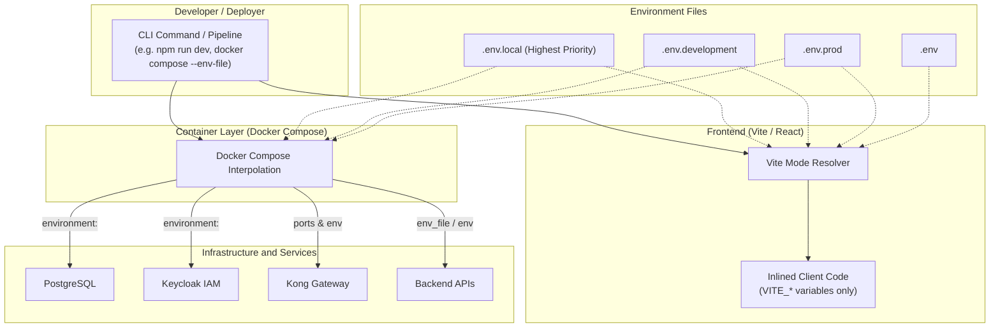

# Environment Selection & Configuration Architecture

This document explains how each component in the **MENTOR** platform (Frontend, Backend, Keycloak, Kong API Gateway, and PostgreSQL) resolves, selects, and consumes environment configuration across **local development**, **staging/development**, and **production** environments.

---

## 1. Architectural Overview

The repository is public, so **no real credentials or secrets are ever committed to Git**. Instead, configuration is organized into structured `.env.*` files:

| File | Purpose | Committed to Git? | Security Level |
| :--- | :--- | :---: | :--- |
| `.env.example` | Blueprint template showing all required keys with dummy values | **Yes** | Public |
| `.env.development` | Default configuration for local and dev team instances | **No** (ignored) | Dev / Non-sensitive |
| `.env.prod` | Production baseline or template for deployment pipelines | **No** (ignored) | Sensitive |
| `.env.local` | Personal local developer overrides (takes highest priority) | **No** (ignored) | Confidential |



---

## 2. Frontend (Vite + React) Environment Selection

The frontend application is located in `/frontend`. Vite has native, built-in support for environment files and runtime modes.

### How Vite Resolves `.env` Files

Vite uses the `--mode` flag to determine which environment files to load. By default:
* Running `npm run dev` sets mode to **`development`**.
* Running `npm run build` sets mode to **`production`**.

Vite loads files in the following order of precedence (earlier files override later ones):

```
1. .env.[mode].local   (e.g., .env.development.local or .env.prod.local)
2. .env.local          (Local developer overrides for all modes)
3. .env.[mode]         (e.g., .env.development or .env.prod)
4. .env                (Universal fallbacks)
```

### Vite Security: The `VITE_` Prefix
To prevent accidentally leaking private API keys or database credentials to the public browser bundle, Vite **only exposes variables prefixed with `VITE_`**:
* `VITE_API_BASE_URL` $\rightarrow$ Accessible in client code via `import.meta.env.VITE_API_BASE_URL`
* `SECRET_DB_PASSWORD` $\rightarrow$ **Ignored** by Vite and never exposed in the browser bundle

### Frontend Command Reference

| Action | Command | Mode | Files Read (In order of priority) |
| :--- | :--- | :--- | :--- |
| **Local Development** | `npm run dev` | `development` | `.env.development.local` > `.env.local` > `.env.development` > `.env` |
| **Build for Production** | `npm run build -- --mode prod` | `prod` | `.env.prod.local` > `.env.local` > `.env.prod` > `.env` |
| **Default Production Build** | `npm run build` | `production` | `.env.production.local` > `.env.local` > `.env.production` > `.env` |

> [!TIP]
> When testing locally against production endpoints, create `frontend/.env.local` and define `VITE_KEYCLOAK_URL` and `VITE_API_BASE_URL`. Because `.env.local` is ignored by Git and has the highest priority, your local tests will never accidentally be committed.

---

## 3. Infrastructure & Services (Docker Compose, Keycloak, Kong, PostgreSQL)

Keycloak, Kong, and PostgreSQL are standard container images. **They do not read `.env` files directly**. Instead, **Docker Compose acts as the mediator**.

### Service Isolation via Docker Compose Profiles

To prevent application and frontend developers from having to download large images (Keycloak is ~1GB, Kong, Postgres) when infrastructure is hosted on a remote VPS or when they only want to work on client/API code, infrastructure services are isolated under **Docker Compose Profiles**:

| Profile | Services Included | Use Case |
| :--- | :--- | :--- |
| *(None / Default)* | Application containers only | Default for developers. **Downloads 0MB of Keycloak/Kong**. |
| **`infra`** | `postgres`, `keycloak`, `kong` | Runs the complete infrastructure stack on VPS or full local testing. |
| **`auth`** | `postgres`, `keycloak` | Runs authentication and Keycloak database only. |
| **`gateway`** | `kong` | Runs Kong API Gateway only. |

> [!CAUTION]
> **Contributor Rule: Never Add Application Containers to `infra`, `auth`, or `gateway` Profiles!**
> * The `infra` profile is strictly reserved for the core infrastructure stack (Keycloak, Keycloak's Postgres, and Kong) hosted on the VPS.
> * Application containers (e.g., backend API, Celery workers, Neo4j, AI agents) must run **without a profile** (or under an `app` profile). This guarantees that standard developers running `docker compose up` start their app services cleanly without downloading heavy (~1GB+) Keycloak images.

#### Running with Profiles:
```bash
# 1. On your VPS or for full local stack (starts postgres, keycloak, kong):
docker compose --profile infra up -d

# 2. Or set in .env (recommended on VPS):
COMPOSE_PROFILES=infra
docker compose up -d

# 3. Running only auth:
docker compose --profile auth up -d

# 4. Normal developers running app services (completely skips infra images):
docker compose up
```

### How Docker Compose Selects Environments

When you execute `docker compose up`, Docker Compose reads an environment file, interpolates the `${VARIABLE}` syntax in `docker-compose.yml`, and injects the resulting values into each container's operating system environment (`environment:` section).

#### 1. Default Behavior (`docker compose up`)
By default, Docker Compose automatically looks for a file named `.env` in the current working directory.

#### 2. Selecting a Specific Environment File (`--env-file`)
To run with a specific environment profile, pass the `--env-file` parameter:

```bash
# Start infrastructure with development profile
docker compose --env-file .env.development up -d

# Start infrastructure with production profile
docker compose --env-file .env.prod up -d

# Start infrastructure with your local private overrides
docker compose --env-file .env.local up -d
```

### How PostgreSQL Receives Environment Variables
In `docker-compose.yml`:
```yaml
services:
  postgres:
    image: postgres:16-alpine
    environment:
      POSTGRES_DB: ${POSTGRES_DB}
      POSTGRES_USER: ${POSTGRES_USER}
      POSTGRES_PASSWORD: ${POSTGRES_PASSWORD}
```
* Docker Compose evaluates `${POSTGRES_DB}` from the chosen `.env.*` file.
* Compose boots the container with OS environment variables `POSTGRES_DB=keycloak`, etc.
* PostgreSQL's official entrypoint script reads these variables on first boot to initialize the database and user.

### How Keycloak Receives Environment Variables
In `docker-compose.yml`:
```yaml
services:
  keycloak:
    image: quay.io/keycloak/keycloak:24.0
    environment:
      KC_DB: postgres
      KC_DB_URL: jdbc:postgresql://postgres:5432/${POSTGRES_DB}
      KC_DB_USERNAME: ${POSTGRES_USER}
      KC_DB_PASSWORD: ${POSTGRES_PASSWORD}
      KC_HOSTNAME_URL: ${KEYCLOAK_HOSTNAME_URL}
      KC_HOSTNAME_ADMIN_URL: ${KEYCLOAK_HOSTNAME_ADMIN_URL}
      KC_HOSTNAME_STRICT: "${KEYCLOAK_HOSTNAME_STRICT}"
      KC_HTTP_RELATIVE_PATH: ${KEYCLOAK_HTTP_RELATIVE_PATH}
      KEYCLOAK_ADMIN: ${KEYCLOAK_ADMIN_USER}
      KEYCLOAK_ADMIN_PASSWORD: ${KEYCLOAK_ADMIN_PASSWORD}
```
* Docker Compose interpolates the values (e.g. database credentials, public host URL, admin credentials).
* Keycloak's Quarkus runtime automatically maps environment variables prefixed with `KC_` to its internal configuration settings (e.g. `KC_DB_URL` $\rightarrow$ database connection string).
* `KEYCLOAK_ADMIN` and `KEYCLOAK_ADMIN_PASSWORD` create or configure the initial administrative superuser.

### How Kong Gateway Receives Environment Variables
In `docker-compose.yml`:
```yaml
services:
  kong:
    image: kong:latest
    ports:
      - "${KONG_PROXY_PORT:-8000}:8000"
      - "${KONG_ADMIN_PORT:-8001}:8001"
```
* Port bindings are resolved dynamically from the active environment file with safe fallbacks (`:-8000`).
* Kong's routes and upstream services are configured declaratively in `docker/kong/kong.yml`.

---

## 4. Backend Services (FastAPI / Node / Python Agents)

For backend Python/Node microservices:

### During Local Development (Host Machine)
Backend services use a settings manager (such as `pydantic-settings` in Python/FastAPI or `dotenv` in Node.js) to resolve the active environment:

```python
# Example: backend/config.py
import os
from pydantic_settings import BaseSettings

ENVIRONMENT = os.getenv("APP_ENV", "development")

class Settings(BaseSettings):
    postgres_db: str
    postgres_user: str
    postgres_password: str
    keycloak_url: str

    class Config:
        # Priority: .env.local > .env.{ENVIRONMENT} > .env
        env_file = (
            ".env.local",
            f".env.{ENVIRONMENT}",
            ".env"
        )

settings = Settings()
```

When running locally:
```bash
# Runs with .env.development by default
python -m uvicorn backend.api.main:app

# Or explicitly select production profile
APP_ENV=prod python -m uvicorn backend.api.main:app
```

### In Docker Compose / Staging
Backend services define `env_file:` in `docker-compose.yml`:
```yaml
services:
  backend-api:
    build: ./backend
    env_file:
      - .env.development
    # Or rely on Docker Compose CLI: docker compose --env-file .env.prod up
```

### In Production Cloud Deployments (Kubernetes / ECS / Cloud Run)
In production, no `.env` files should be placed on disk or checked into Git. Instead:
1. Cloud secret providers (e.g., AWS Secrets Manager, GCP Secret Manager, Vault, or Kubernetes Secrets) inject environment variables directly into the container process.
2. The backend application directly reads `os.environ` without requiring a physical `.env` file.

---

## 5. Summary Matrix & Quick Cheat Sheet

### Which component reads which file?

| Component | How it selects the environment | Fallback / Precedence |
| :--- | :--- | :--- |
| **Frontend (Vite)** | `npm run dev` (development mode)<br>`npm run build -- --mode prod` (prod mode) | `.env.[mode].local` $\rightarrow$ `.env.local` $\rightarrow$ `.env.[mode]` $\rightarrow$ `.env` |
| **Docker Compose** | `--env-file <filepath>` flag (e.g., `--env-file .env.development`) | Looks for `.env` in working directory if `--env-file` is omitted |
| **Keycloak** | Inherits `KC_*` environment variables from Docker container | Defaults configured in `docker-compose.yml` |
| **Kong Gateway** | Inherits port mappings and `KONG_*` environment variables from Docker | Fallback defaults like `${KONG_PROXY_PORT:-8000}` |
| **PostgreSQL** | Inherits `POSTGRES_*` environment variables from Docker container | Defaults in `docker-compose.yml` |
| **Backend Services** | Reads `APP_ENV` variable or container environment directly | `.env.local` $\rightarrow$ `.env.{APP_ENV}` $\rightarrow$ Container OS Env |

---

## 6. Setup Instructions for New Developers

1. **Clone the repository**:
   ```bash
   git clone <repo-url>
   cd J26-SE-363
   ```

2. **Initialize Root Environment**:
   ```bash
   cp .env.example .env.development
   # Optionally create personal overrides
   cp .env.example .env.local
   ```

3. **Initialize Frontend Environment**:
   ```bash
   cd frontend
   cp .env.example .env.development
   cd ..
   ```

4. **Start Infrastructure Services**:
   ```bash
   docker compose --env-file .env.development up -d
   ```

5. **Start Frontend Development Server**:
   ```bash
   cd frontend
   npm install
   npm run dev
   ```

Frontend will automatically load `frontend/.env.development` (and `frontend/.env.local` if present) and connect to Keycloak & Kong at `http://localhost:8000`.

---

## 7. Moving Infrastructure to a Cloud VPS (Single-Variable Switch)

When moving Keycloak, PostgreSQL, and Kong to a remote VPS so that developers do not need to run Docker locally, **you only need to change a single variable**:

### In `.env` (or `.env.development` / `.env.local`):
```ini
GATEWAY_PUBLIC_URL=https://api.yourdomain.com
VITE_GATEWAY_URL=https://api.yourdomain.com
# (or http://<VPS_IP>:8000)
```

### What Automatically Updates from this Single Change:
1. **Docker Compose (`docker-compose.yml`)**:
   Keycloak's `KC_HOSTNAME_URL` and `KC_HOSTNAME_ADMIN_URL` automatically fall back to `${GATEWAY_PUBLIC_URL}/auth`.
2. **Frontend Keycloak Client (`frontend/src/shared/auth/keycloak.js`)**:
   Automatically derives `keycloakUrl` from `VITE_GATEWAY_URL/auth`.
3. **Frontend Vite Dev Proxy (`frontend/vite.config.js`)**:
   Dynamically loads root and local `.env` files and routes `/api/*` requests to `gatewayUrl`.
4. **Keycloak Client Redirects (`realm-export.json`)**:
   Pre-configured with wildcard redirects (`http://localhost:*/*` and `https://*/*`) so local developers and deployed apps can log in against the VPS Keycloak out-of-the-box.
5. **Kong CORS (`docker/kong/kong.yml`)**:
   Pre-configured to permit requests from developer machines (`http://localhost:5173`, `http://127.0.0.1:5173`, `http://localhost:3000`).

