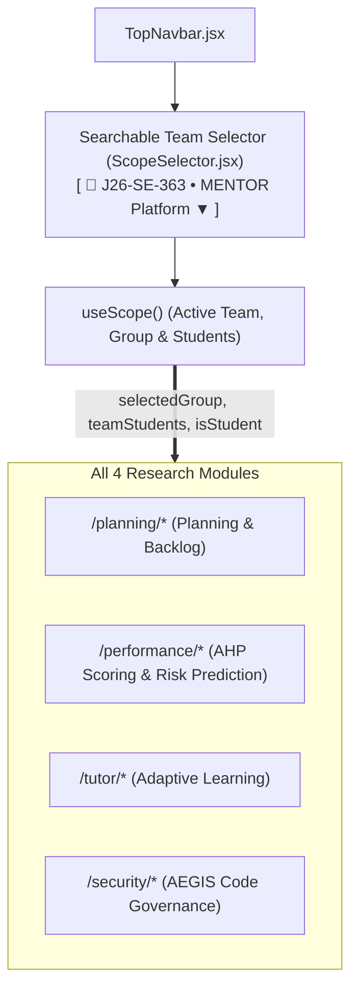

# MENTOR Academic Hierarchy & Global Scope Guidelines

This document is the **single source of truth** for all 4 module teams (**Project Planning**, **Performance Assessment**, **Adaptive AI Tutor**, and **AEGIS Security**) on how to consume and interact with the **Academic Scope Hierarchy**.

---

## 🏛️ The 5-Tier Academic Hierarchy

Every module in MENTOR operates within the exact same 5-level educational structure:

```text
🎓 1. Batch           (e.g., "2026 — Year 4 Semester 1")
    └── 💻 2. Specialization (e.g., "Software Engineering", "Cyber Security", "Data Science")
         └── 👥 3. Group          (e.g., "Group 07 — J26-SE-363")
              └── 📁 4. Team / Project (e.g., "MENTOR Platform Core")
                   └── 👤 5. Student        (e.g., "Sadeesha Sathsara", "IT23155534")
```

---

## 🎯 The Global Problem Solved

### The Anti-Pattern (What we avoided)
Without a shared hierarchy:
- Each developer builds their own custom Batch and Group dropdowns on their pages.
- A supervisor selecting "Group 07" on the Planning page loses their selection as soon as they navigate to Performance or Security.
- Student vs Instructor permissions are handled inconsistently.

### The MENTOR Platform Standard
1. **Single Lightweight Context (`useScope()`)**: A shared context manages the active supervised research team/group across the platform.
2. **Top Navbar Searchable Team Selector (`ScopeSelector.jsx`)**: Integrated directly into `TopNavbar.jsx` right beside the logo, saving vertical space and keeping the interface clean.
3. **Role-Adaptive Experience**:
   - **Student**: The top bar displays their **locked, enrolled team badge** (`J26-SE-363 • MENTOR Platform`). No selectors needed.
   - **Instructor & Admin**: A sleek dropdown with an **integrated search bar** allowing instant switching between supervised groups by group code, project title, or team name.
4. **Micro-Scope / Students Managed at the Page/Tab Level**:
   - Students are never crowded into header dropdowns. Instead, individual students and team members are viewed on the page (in roster tables, tabs, and detail routes like `/performance/students/:id`).
5. **Persistent State**: Selections are saved in session storage so switching modules or refreshing the browser retains the active team.

---

## 🗺️ Visual Architecture Diagram



---

## 💻 Developer Guide: How to Use `useScope()` in Any Module

Any developer on the team can access the active academic context in **one line of code**:

```jsx
import { useScope } from '@/shared/context/useScope'
```

### 1. Basic Component Usage

```jsx
export default function GroupDashboard() {
  const {
    isLocked,             // true for students, false for instructors
    selectedBatch,        // { id, name, code, year, semester }
    selectedSpecialization, // { id, name, code, color }
    selectedGroup,        // { id, code, name, projectTitle, repositoryUrl }
    selectedStudent,      // { id, studentId, name, email, ... } or null if "All"
  } = useScope()

  return (
    <div>
      <h1>Active Group: {selectedGroup?.name}</h1>
      <p>Specialization: {selectedSpecialization?.name}</p>
      <p>Repository: {selectedGroup?.repositoryUrl}</p>
    </div>
  )
}
```

---

### 2. Connecting with TanStack Query (`useQuery`)

To ensure data automatically refetches when an instructor changes the selected group in the top bar, **always include the scope IDs in your `queryKey`**:

```jsx
import { useQuery } from '@tanstack/react-query'
import { useScope } from '@/shared/context/useScope'
import { performanceService } from '../services/performanceService'

export default function PerformanceMetrics() {
  const { selectedBatch, selectedGroup, selectedStudent } = useScope()

  const { data, isLoading } = useQuery({
    // Include scope IDs in the queryKey for automatic cache invalidation
    queryKey: [
      'performance-overview',
      selectedBatch?.id,
      selectedGroup?.id,
      selectedStudent?.id,
    ],
    queryFn: () =>
      performanceService.getOverview({
        batchId: selectedBatch?.id,
        groupId: selectedGroup?.id,
        studentId: selectedStudent?.id,
      }),
    enabled: Boolean(selectedGroup?.id),
  })

  if (isLoading) return <LoadingSkeleton />

  return <div>{/* Render metrics scoped to selectedGroup */}</div>
}
```

---

## 🌐 Standardized Backend Query Parameters

When sending HTTP requests from your frontend services to the backend APIs, use these standardized query parameters:

| Parameter | Type | Example Value | Description |
| :--- | :--- | :--- | :--- |
| `batch_id` | String | `batch-2026-y4s1` | Unique ID of the academic batch |
| `specialization_id` | String | `spec-se` | Specialization identifier |
| `group_id` | String | `grp-j26-se-363` | Group identifier |
| `student_id` | String (Optional) | `std-it23155534` | Specific student ID, or omitted for whole group |

Example in a module service:
```javascript
// src/modules/<module-name>/services/<name>Service.js
import apiClient from '@/shared/api/apiClient'

export const planningService = {
  getSprintBacklog: ({ batchId, groupId }) => {
    return apiClient.get('/api/planning/backlog', {
      params: {
        batch_id: batchId,
        group_id: groupId,
      },
    })
  },
}
```

---

## 📋 Role Behavior Summary

| Feature | Student Persona | Instructor / Admin Persona |
| :--- | :--- | :--- |
| **Scope Bar** | Read-only badges (`Locked`) | Interactive cascading dropdown pickers |
| **Group Selection** | Pre-locked to their enrolled group | Freedom to switch between any group |
| **Student Selection** | Pre-locked to themselves | Option to select "All Students" or a specific student |
| **Persistence** | Derived from verified profile | Saved in `sessionStorage` across sessions |
