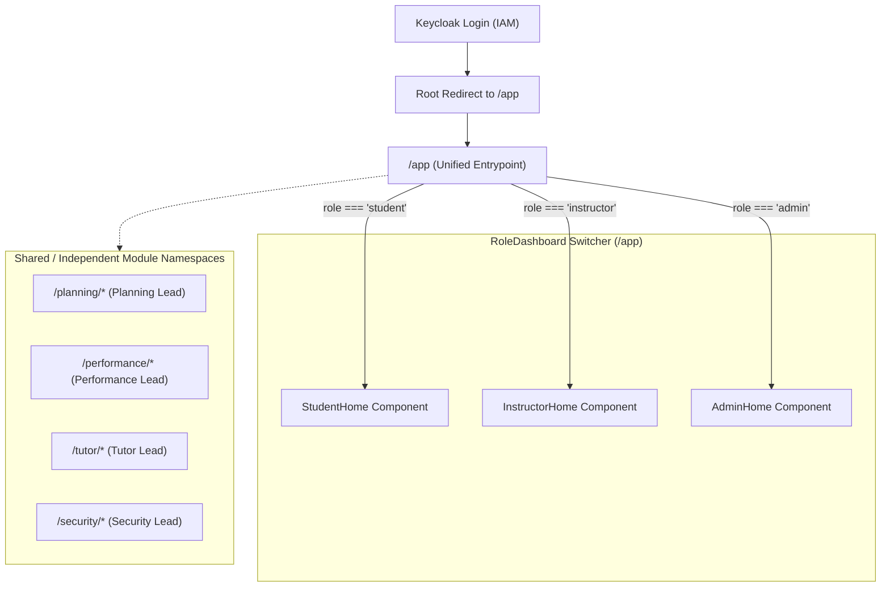
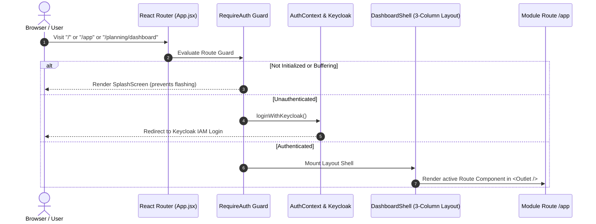

# MENTOR Frontend Routing & Navigation Architecture Guide

This document is the **single source of truth** for all developers contributing to the **MENTOR** frontend routing, navigation hierarchy, and role-based views.

---

## 🎯 Architecture Overview

MENTOR follows modern SaaS standards (comparable to **Linear**, **GitHub**, and **Canvas LMS**) using a **Unified App Shell** with **Domain-Driven Routing** and a **Role-Polymorphic Entrypoint**.

### The Core Problem Solved
In legacy or poorly-structured web apps, developers often prefix routes with user roles (e.g. `/student/dashboard` vs `/instructor/dashboard` vs `/admin/dashboard`). This causes:
- **Route Collisions**: Two developers create clashing paths for the same logical page.
- **Broken Link Sharing**: A link shared between team members fails or exposes the wrong UI.
- **Leaked Role Paths**: Clunky URLs that expose internal role taxonomy.
- **Git Merge Hell**: Multiple team members constantly editing the root router table.

### The MENTOR Routing Solution
1. **Single Entry Route (`/app`)**: All authenticated users land on `http://localhost:5173/app`. The app determines the user's role from the verified JWT token and dynamically renders the appropriate Home/Overview workspace ([`StudentHome`](../src/shared/pages/dashboards/StudentHome.jsx), [`InstructorHome`](../src/shared/pages/dashboards/InstructorHome.jsx), or [`AdminHome`](../src/shared/pages/dashboards/AdminHome.jsx)).
2. **Domain-Driven Modules**: Each research module owns an independent URL namespace (`/planning/*`, `/performance/*`, `/tutor/*`, `/security/*`). Developers never edit other team members' route tables.

---

## 🗺️ Visual Architecture Diagram



---

## 🛡️ Authentication & Route Protection Lifecycle

The route protection lifecycle is handled by [`RequireAuth.jsx`](../src/shared/auth/RequireAuth.jsx) and [`DashboardShell.jsx`](../src/shared/layout/DashboardShell.jsx):



---

## 📁 Developer Team Ownership & Namespaces

To ensure complete developer isolation and eliminate merge conflicts, the application is divided strictly by domain:

| Domain / Module | Path Prefix | Directory | Team Owner |
| :--- | :--- | :--- | :--- |
| **Unified Shell** | `/app` | `src/shared/pages/dashboards/` | Shared Platform |
| **Project Planning** | `/planning/*` | `src/modules/planning/routes.jsx` | Planning Dev |
| **Performance Analytics** | `/performance/*` | `src/modules/performance/routes.jsx` | Performance Dev |
| **Adaptive AI Tutor** | `/tutor/*` | `src/modules/tutor/routes.jsx` | AI Tutor Dev |
| **Security & Compliance** | `/security/*` | `src/modules/security/routes.jsx` | Security Dev |
| **Platform Administration** | `/admin/*` | `src/modules/admin/routes.jsx` | Admin Dev |

> [!IMPORTANT]
> **The Golden Rule of Team Routing**:
> Developers must **ONLY** add or edit routes inside their own `src/modules/<module-name>/routes.jsx`.
> **Never** edit `src/App.jsx` to register individual feature pages.

---

## 📖 Complete Developer Tutorial: Adding a New Page

Here is an end-to-end example of how a developer adds a new page to their module without causing conflicts.

### Example: Adding a "Milestones" page in the Planning module

#### Step 1: Create the Page Component
Create your component in your module directory:
```jsx
// src/modules/planning/pages/MilestonesPage.jsx
import { PageHeader } from '@/shared/components/PageHeader'
import { Card } from '@/components/ui/card'

export default function MilestonesPage() {
  return (
    <div className="space-y-6">
      <PageHeader
        title="Project Milestones"
        subtitle="Track delivery gates, sprint deadlines, and deliverables."
      />
      <Card className="p-6 bg-card border border-border shadow-xs">
        <p className="text-muted-foreground">Milestones content goes here.</p>
      </Card>
    </div>
  )
}
```

#### Step 2: Register in your Module's `routes.jsx`
Open `src/modules/planning/routes.jsx` and add your route:
```jsx
// src/modules/planning/routes.jsx
import { Routes, Route } from 'react-router-dom'
import MilestonesPage from './pages/MilestonesPage'

export default function PlanningRoutes() {
  return (
    <Routes>
      {/* Existing routes */}
      <Route path="dashboard" element={<PlanningDashboard />} />
      
      {/* Your new route: accessible at /planning/milestones */}
      <Route path="milestones" element={<MilestonesPage />} />
    </Routes>
  )
}
```

#### Step 3: Add to Navigation Menu
Open `src/shared/layout/navConfig.js` and add the link to the corresponding role's navigation tree:
```javascript
// src/shared/layout/navConfig.js
{
  label: 'Project Planning',
  icon: BookOpen,
  color: '#2563eb',
  children: [
    { label: 'Dashboard', to: '/planning/dashboard' },
    { label: 'Milestones', to: '/planning/milestones' }, // <-- Added here
    // ...
  ]
}
```

---

## 🔒 Role-Gated Sub-Routes (Best Practices)

When a specific page inside a module is strictly restricted to instructors or administrators (e.g. grading or student evaluation):

### 1. Explicit Feature Namespacing
Do not duplicate routes. Name the feature according to its action:
- ✅ `/performance/my-progress` (Student self-tracking)
- ✅ `/performance/assessments` (Instructor grading and student evaluations)
- ❌ `/student/performance` vs `/instructor/performance`

### 1. Declarative Route Guard with `<RequireRole />` (Recommended)
Wrap restricted routes in your module's `routes.jsx` with `<RequireRole allowedRoles={[...]}>`. If an unauthorized user attempts to visit the URL directly, they are immediately blocked with a clean **403 Access Denied** screen:

```jsx
// Example from src/modules/planning/routes.jsx
import RequireRole from '@/shared/auth/RequireRole'

<Routes>
  {/* Public to all authenticated users */}
  <Route path="blackboard" element={<Blackboard />} />

  {/* Restricted to Instructors and Admins */}
  <Route element={<RequireRole allowedRoles={['instructor', 'admin']} />}>
    <Route path="instructor/dashboard" element={<InstructorDashboard />} />
    <Route path="instructor/projects" element={<InstructorProjects />} />
  </Route>
</Routes>
```

#### Fallback Options:
By default, `<RequireRole />` renders the [`Unauthorized.jsx`](../src/shared/pages/Unauthorized.jsx) 403 screen with a "Return to Dashboard" button. You can also pass `fallback="redirect"` to silently bounce unauthorized users back to `/app`:

```jsx
<Route element={<RequireRole allowedRoles={['admin']} fallback="redirect" />}>
  ...
</Route>
```

### 2. In-Component Dynamic UI
For pages shared by multiple roles where only certain actions should appear (e.g. grading buttons or admin toggles), inspect `user.role` from `useAuth()`:

```jsx
import { useAuth } from '@/shared/auth/useAuth'

export default function ProjectBoard() {
  const { user } = useAuth()

  return (
    <div>
      <KanbanBoard />
      {user.role === 'instructor' && (
        <Button onClick={gradeSubmission}>Grade Work</Button>
      )}
    </div>
  )
}
```

---

## ⚡ Summary of Changes in Unified Routing

1. **Root URL (`/`)**: Automatically redirects authenticated users to `/app`.
2. **Unified Overview (`/app`)**: Single entry point that polymorphically renders `StudentHome`, `InstructorHome`, or `AdminHome`.
3. **Legacy Fallbacks**: `/student`, `/instructor`, `/admin` gracefully redirect to `/app` to ensure backward compatibility with bookmarks and active sessions.
